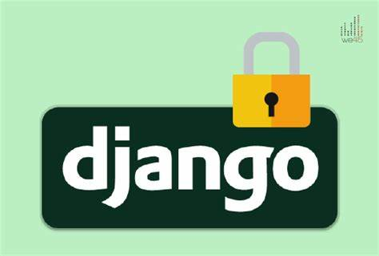

## Introduction to Django 5

Django 5 is a new and improved version of the popular Python-based web framework, offering numerous features for fast and secure web development. In this article, we will explore the changes and new capabilities introduced in this release.

****

---

## New Features in Django 5

### 1. Improved ORM Performance
One of the most significant updates in Django 5 is the optimization of **ORM (Object-Relational Mapping)**. This version utilizes more efficient queries, leading to faster data processing.

**New ORM Features:**
- Support for **Query Hints** for optimized query execution
- Ability to use **Materialized Views** in the database
- Enhanced **Prefetch Related** for complex query optimizations

****

---

### 2. Type Hinting Support in Views and Models
Django 5 now offers better support for **Type Hinting** in views, models, and forms. This feature improves code readability and helps prevent unexpected errors.

```python
from django.http import HttpRequest, HttpResponse

def my_view(request: HttpRequest) -> HttpResponse:
    return HttpResponse("Hello, Django 5!")
```

**Advantages:**
- Reduced typing errors
- Better integration with static code analysis tools like MyPy

****

---

### 3. Enhanced WebSocket and Async Support
Django 5 has fully improved support for **Asynchronous Views** and **WebSockets**, allowing developers to build real-time and optimized applications.

#### WebSocket Example:
```python
from django.http import JsonResponse
from django.views import View

class AsyncView(View):
    async def get(self, request):
        return JsonResponse({"message": "This is an async response!"})
```

****

---

### 4. Security and Authentication Enhancements
Django 5 includes new security features such as:
- Support for **OAuth 2.1** for better authentication
- **Rate Limiting** in Middleware
- **SameSite Cookie Enforcement** to prevent CSRF attacks

****

---

## Conclusion
With major improvements in **ORM, Type Hinting, WebSocket support**, and **security**, Django 5 takes the developer experience to the next level. If you’re still using older versions, now is a great time to upgrade and take advantage of its new features!

**Have you tried Django 5 yet? Share your thoughts in the comments!** 🚀

